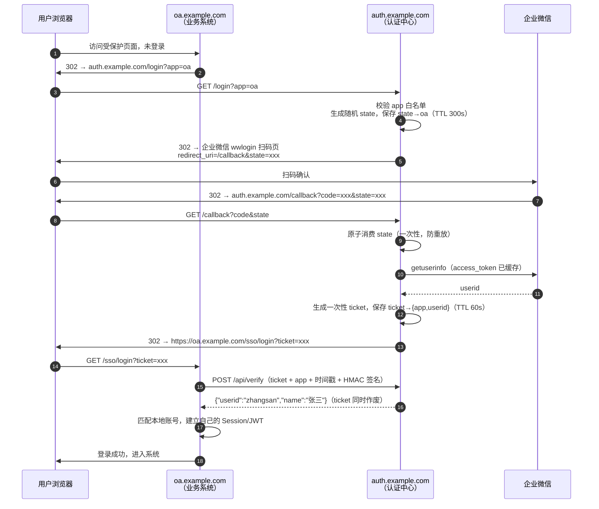

# 架构与设计

## 完整登录时序



## HTTP 接口设计

### GET /login

业务系统发起登录的入口。

| 参数 | 必填 | 说明 |
| --- | --- | --- |
| `app` | 是 | 业务系统标识（如 `oa`），必须在配置白名单中 |
| `redirect` | 否 | 登录成功后业务系统内的相对路径（如 `/dashboard`），原样带回，由业务系统自行校验 |

流程：

1. `app` 不在白名单 → 400，不泄露任何信息。
2. 生成 128 位以上 `crypto/rand` state，保存 `state → {app, redirect, created_at}`，TTL 300s。
3. 302 到企业微信扫码页（PC 浏览器场景）：

```
https://login.work.weixin.qq.com/wwlogin/sso/login
  ?login_type=CorpApp
  &appid={CORPID}
  &agentid={AGENTID}
  &redirect_uri=https://auth.example.com/callback
  &state={STATE}
```

> 企业微信内置浏览器（H5 场景）改用网页授权入口
> `https://open.weixin.qq.com/connect/oauth2/authorize?...&scope=snsapi_base&agentid={AGENTID}#wechat_redirect`，
> 由 `/login` 按请求 User-Agent 或配置的 `mode` 参数区分。

### GET /callback

企业微信唯一配置的回调地址。参数：`code`、`state`（企业微信原样带回）。

1. 原子消费 `state`：不存在或已过期 → 403 页面（防重放：取到即删）。
2. 用 `code` 换取身份：
   - `GET https://qyapi.weixin.qq.com/cgi-bin/gettoken?corpid=&corpsecret=` → `access_token`（缓存 7200s，提前 5 分钟刷新，加锁防并发击穿）；
   - `GET https://qyapi.weixin.qq.com/cgi-bin/auth/getuserinfo?access_token=&code=` → `userid`。
3. 生成一次性 `ticket`，保存 `ticket → {app, redirect, userid}`，TTL 60s。
4. 302 到白名单中该 app 的回调地址：`https://oa.example.com/sso/login?ticket=xxx&redirect=/dashboard`。

任何失败（state 无效、企业微信接口报错）都跳转到统一错误提示页，不重定向回业务系统。

### POST /api/verify

业务系统后端专用，浏览器不直接调用。

请求（JSON）：

```json
{
  "app": "oa",
  "ticket": "xxx",
  "ts": 1726650000,
  "sign": "hex(HMAC-SHA256)"
}
```

签名算法（与 `client-integration.md` 示例一致）：

```
sign = hex( HMAC-SHA256( key = app_secret, message = app + "\n" + ticket + "\n" + ts ) )
```

校验：签名正确（恒定时间比较）→ `ts` 与服务器时间偏差 ≤ 60s → ticket 存在且 `ticket.app == app`。任一不满足返回统一错误码（`invalid_app` / `invalid_sign` / `expired_ts` / `invalid_ticket`）。

通过后**立即删除 ticket**，返回：

```json
{ "userid": "zhangsan", "name": "张三" }
```

每个业务系统在认证中心配置文件中登记 `app` 标识、回调域名和独立的 `app_secret`（仅用于 verify 签名，与企业微信 secret 无关）。

### 其他

- `GET /healthz` — 健康检查。
- `GET /WW_verify_xxxxxxxx.txt` — 企业微信域名归属校验文件，从 `web/static/` 直接服务。
- `GET /error` — 统一错误提示页。

## 数据设计

state 与 ticket 均为秒级短时效数据，统一走存储抽象：

```go
type Store interface {
    SaveState(ctx, state string, rec StateRecord, ttl time.Duration) error
    TakeState(ctx, state string) (StateRecord, bool)   // 取出即删，防重放
    SaveTicket(ctx, ticket string, rec TicketRecord, ttl time.Duration) error
    TakeTicket(ctx, ticket string) (TicketRecord, bool) // 取出即删
}
```

- 第一阶段 `MemoryStore`：`map` + 互斥锁 + 过期惰性清理，单实例部署。
- 第三阶段 `RedisStore`：`SET key val EX ttl` + Lua/GETDEL 原子取出，支持多实例。

`access_token` 缓存随实例内存即可；引入多实例后亦无需共享（各自获取不会互相挤掉，企业微信 token 有效期内重复获取返回相同值）。

## 安全设计

1. **Open Redirect**：`app` → 域名映射只存在于配置文件；请求参数永远不接受完整 URL，`redirect` 只接受业务系统内的相对路径。
2. **state**：`crypto/rand`，≥128 位，一次性消费，300s 过期。
3. **ticket**：一次性消费，60s 过期，绑定 `app`（verify 时校验归属匹配）。
4. **verify 认证**：每业务系统独立 `app_secret` + HMAC-SHA256 + 时间戳防重放；恒定时间比较防时序攻击。
5. **密钥管理**：企业微信 `secret` 与各 `app_secret` 只存服务端配置文件（权限 600），不进 git，不入前端。
6. **传输**：全站 HTTPS，Nginx 开启 HSTS。
7. **限流**：`/login`、`/api/verify` 按 IP 简单令牌桶，防止刷接口探测。
8. **审计日志**：记录 state 校验失败、ticket 重放、verify 签名失败、企业微信接口错误等安全事件。

## 已知限制与演进方向

- 第一阶段单实例内存存储：重启会导致进行中的登录流程失败（用户重扫即可），可接受；多实例需求出现时切 Redis。
- 阶段四（可选）：认证中心维护自身会话 Cookie（域 `auth.example.com`），已登录用户访问 `/login` 免扫码直接发 ticket，实现多系统单点登录（SSO）；登出广播暂不做。
- userid 与业务系统本地账号的映射策略由各业务系统自行决定（预建账号 / 首登自动关联），见 client-integration.md。
